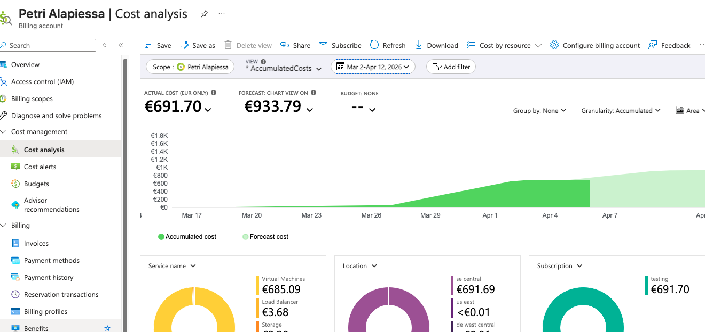

When I returned to work after the Easter holiday, I had a shock. While browsing my emails, I noticed several Azure cost alert messages in my junk folder. They were related to my personal Azure subscription, which I have been using for learning and testing purposes. When I opened the cost analysis view for my subscription, the charges became visible, as shown in the image below.

As you can see from the image, I had consumed about 700 € worth of Azure resources, and that cost did not even include taxes. How was this possible?

To improve my skills in using Azure AI services, I started experimenting with Azure AI Foundry at the end of March and the beginning of April. My objective was to learn how to deploy and use language models. Although deployments are created in Foundry, the total resource usage and cost are not visible there. Instead, you need to check them in the Azure portal. I learned that lesson the hard way, and I will remember it for the rest of my life.

Most of the cost came from virtual machines located in Sweden Central, which is visible in the image above. Some models require GPU-backed compute, which can cost 2-10 € per hour. The expensive Azure AI Foundry project had Ollama-3-2-1b-4 deployed. You might think such a small model would be cheap, but that was not the case. As an AI assistant explained: "When you deploy an Ollama model in Foundry (or Azure AI Studio), the service typically provisions a GPU-backed VM or VM Scale Set, even though a 2.1B model can run on CPU." This inference infrastructure stays available even when the model is not being used, and the costs continue to accumulate.

Even though OpenAI models such as GPT-4 or GPT-4 Turbo are larger than Ollama, they are hosted by Microsoft and billed per token, so no dedicated virtual machines are required. This is the case in typical chat-like usage, where requests arrive one by one. If multiple requests are sent at once in a batch-style workload, then extra compute power may be required, but that is a different use case.

## What actually caused the bill
The main reason for the bill was that I did not understand how some Azure AI Foundry deployments work. I did not realize that a model deployment might require dedicated compute infrastructure in the background, and that this infrastructure can keep running even when the model is idle.

While experimenting with Azure AI Foundry, I should have checked the Azure portal regularly to review the active resources and the cost forecast. Instead, I left the services running during a short holiday because I wanted to continue my exercise afterwards. At the same time, the Azure cost alerts emails ended up in junk folder, so I had no idea that the charges were increasing.

## How to avoid inference costs
Here is the checklist I now follow to avoid this kind of surprise:

- If you only need to experiment with open-source language models, compare pricing carefully before deploying them in Azure AI Foundry. In some cases, other providers such as Hugging Face may be cheaper for simple testing.
- Check the Azure portal frequently while you are experimenting. Do not rely only on alerts.
- Review both the active resources and the cost forecast in your Azure subscription.
- Delete unused deployments and compute resources at the end of the day if you do not need them.
- Learn to recreate your environment with scripts so that removing resources does not slow you down too much.
- Remember that GPU-backed deployments may generate hourly infrastructure charges even when they are idle.
- Make sure cost alert emails do not end up in your junk folder.

## How did the story end?
After the initial shock, I realized that I needed to contact Microsoft support and explain the situation. With a free subscription, creating a support request was not straightforward. I kept running into a maze of automated suggestions without a clear way to open a real support case. In the end, I managed to submit one.

I am grateful to the support person who replied and explained the situation clearly. The first bill was partly refunded. Because the charges were spread across two months, I then had to wait for the second bill. At that point, I could no longer create a new support request, but I still had the email contacts from the first case and was able to reach the same people again after the second bill had been paid. That bill was also refunded.

In the end, I had to pay only about one third of the calculated costs. I hope you never run into the same kind of trouble, or at least that this post helps you avoid it.