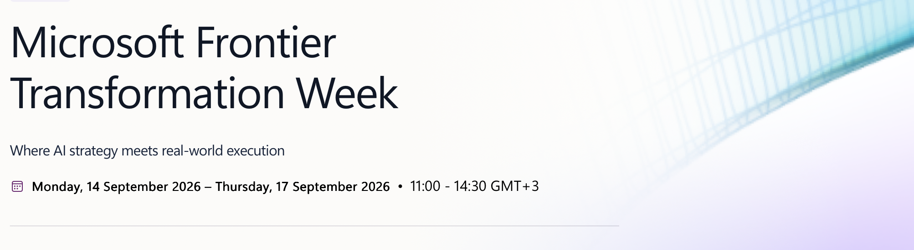

Last week Microsoft hosted a Frontier Transformation Week event focused on bringing AI and agents into everyday work. The goal is to show participants how agents can be used in real production scenarios and how to build agentic solutions using Microsoft technologies.

On Thursday, a hackathon kicked off as part of the event, and I decided to join with one of my own ideas. We have one week to complete our projects and submit the results.

My plan is to create a software development team consisting of two AI agents and a human reviewer. The team will include a developer agent, a test analyst agent, and a human responsible for reviewing and approving the results. The agents will work on an open-source web application originally created by Bita Yeganeh [BitaYeganeh/hrApp](https://github.com/BitaYeganeh/hrApp) during her studies.

The project repository is hosted in GitHub: [palapiessa/hrApp](https://github.com/palapiessa/hrApp). The team's development process will be built around GitHub tools and workflows. The application itself is deployed to Azure, while the agents will be implemented using Microsoft Foundry.

On Friday I was mostly about getting the foundations in place. I created accounts for my developer and test analyst agents so they can participate in the GitHub workflow. That turned out to be more complicated than expected. I could only create one Google account because my phone number was already associated with my personal account and Google limits how many accounts can use the same number. I wasn't able to get an iCloud account working, but I had better luck with Microsoft accounts. One interesting discovery was that Microsoft account usernames apparently cannot include the word "agent".

I also managed to burn through quite a few tokens while setting up the project across GitHub and Azure. GitHub Copilot has already informed me that I've used 80% of my monthly token allocation, and the actual hackathon work has barely started.

I'll try to post daily updates throughout the challenge so you can follow the progress, the setbacks, and hopefully some interesting results as this AI-powered development team takes shape over the next few days. Stay tuned for Day 2! 
