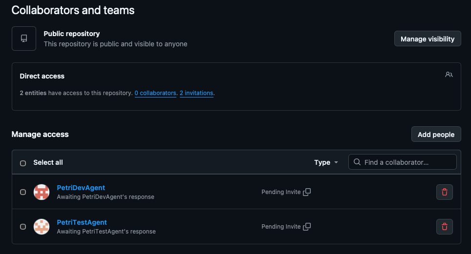

Yesterday I invited the two agent accounts as collaborators to my GitHub repository. I also wanted to verify that a collaborator has the necessary rights to contribute code and submit changes for review.

While exploring the repository settings, I tried to find a place where collaborator permission levels could be viewed or modified. However, there was no visible rights selection or role configuration for collaborators. After some investigation, I learned that the repository is under my personal GitHub account rather than a GitHub organisation. For personal repositories, GitHub primarily distinguishes between the repository owner and collaborators, and collaborators effectively receive write access. The more granular permission levels available for organisation-owned repositories are not exposed in the same way.

Next, I wanted proof that the agent accounts could actually participate in the workflow. I logged in as **PetriDevAgent**, created a branch, edited the README directly in the GitHub web UI, committed the changes, pushed them, and created a pull request. I was then able to review and approve the PR from my own account. That successfully validated the basic development workflow for the project.

So far, everything is working as expected. However, several important questions still remain. How can the agents work with the code autonomously? What kind of development environment should they use? Should each agent have its own container and local repository clone? Or could they work directly through GitHub's web interface? These are the challenges I'll start exploring next.

Keep following the series to see whether these obstacles can be overcome and whether the AI development team can become a reality.