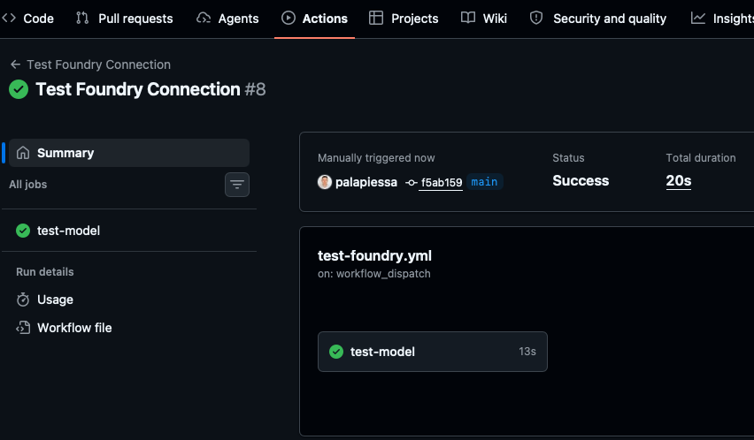

Yesterday turned out to be an important milestone for the project. Instead of focusing on the developer and test agents themselves, I spent most of the day building the infrastructure they will eventually use to collaborate with GitHub.

The first task was deploying a language model to Azure AI Foundry. I decided to deploy **GPT-5.4-mini**. The model is now available through my Foundry project and can be accessed through an OpenAI-compatible API endpoint.

Once the model was deployed, I stored the required endpoint, deployment, and API key information as GitHub Actions secrets. Of course, nothing worked perfectly on the first attempt.

The initial workflow failed because the API key was not available inside the GitHub Action. It took several iterations to track down the problem. Finally a GitHub Action successfully called the GPT-5.4-mini deployment and received a response back from Azure AI Foundry.

The workflow now looks like this:

Human → GitHub Action → Azure AI Foundry → GPT-5.4-mini → Response

It may seem like a small achievement but at least the core integration between GitHub Actions and the AI model is now working.

My next goal is to create the first version of the Developer Agent workflow. Things are starting to get really interesting now. Until now I've mostly been building the foundation, creating accounts, configuring GitHub, deploying models, and connecting services together. There are only two days left in the hackathon, which admittedly makes me a little nervous. There's still a lot of work ahead before I can demonstrate the full workflow from issue to pull request.

Keep following the series to see whether the Developer Agent can move from analyzing tasks to actually contributing code.