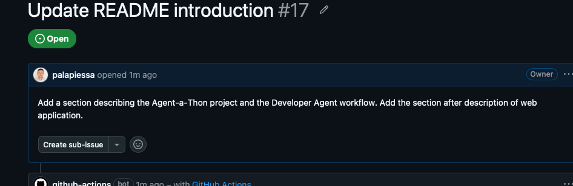
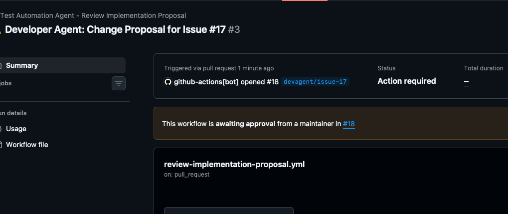

## Developer Agent: Planning + Implementation

One of the most interesting changes was splitting the Developer Agent into two separate workflows.

The Planning Agent analyzes:
- The GitHub issue
- Repository structure
- Existing project files

and produces a structured JSON response describing which files should be modified and why.



Example output:
```json
{
  "files_to_modify": [
    {
      "path": "README.md",
      "reason": "Contains the project introduction and web application description."
    }
  ]
}
```

The Implementation Agent then consumes that planning output, reads the issue details, opens the selected files, updates them, commits the changes, and creates a pull request.



The Developer Agent managed to update multiple Markdown files automatically and created a PR containing the changes so the agent moved from discussing changes to actually modifying repository content.

## Test Automation Agent

The Test Automation Agent also became more useful today: it reviews the Developer Agent's proposals and pull requests, identifies risks, highlights missing acceptance criteria, and suggests test scenarios.

The most interesting aspect is that the two agents now have distinct responsibilities:
- Developer Agent plans and implements
- Test Automation Agent reviews and challenges the proposal

For the first time it felt like observing a small software team working inside GitHub.

## Playwright in CI

I also added a baseline Playwright test myself to the project and created a GitHub Actions workflow to execute it. The workflow completed successfully and the test passed. The next goal is to have the Test Automation Agent generate Playwright tests based on actual implementation changes and commit those tests back into the repository.


After that, I'd like to connect the workflow to Azure deployment and execute Playwright tests against a deployed environment. I also need to prepare the submission presentation for the hackathon and challenge the AI team with a few end-to-end demo runs.

The submission deadline is tomorrow morning (EEST), so there is still plenty to do, but for the first time I'm feeling confident that the project will come together in time.

#AI #AgenticAI #AzureAI #AzureAIFoundry #GitHubActions #Playwright #SoftwareTesting #DevOps #Automation #QualityEngineering #Hackathon