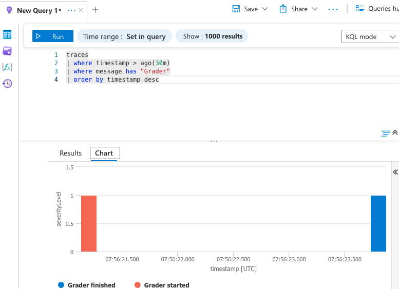
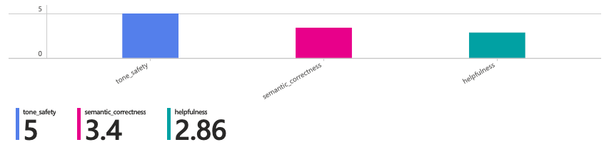
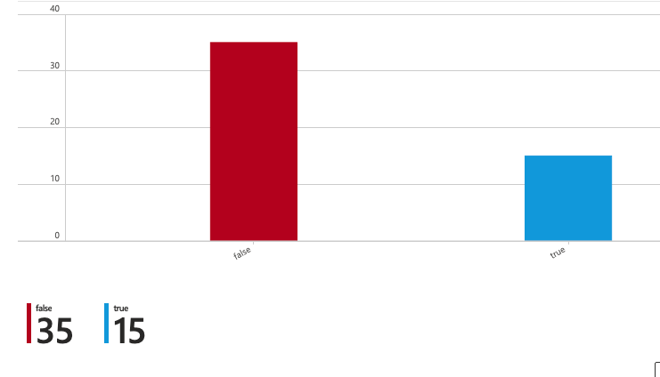

<script src="https://cdn.jsdelivr.net/npm/mermaid@10/dist/mermaid.min.js"></script>
<script>mermaid.initialize({ startOnLoad: true });</script>

In the [previous chapter](./support-bot/2026-03-03-LLM-grader.md) we evaluated the support bot against several criteria. The results sat in a CSV file on disk which is fine for a one-off test, but hard to compare when you run tests repeatedly or want to share findings. A centralized store helps to keep results organized. Instead of comparing CSV files manually, you can track grader quality over time and share the same view with a team. It would also enable a searchable timeline and provide query tools to analyze results and create trend analysis. 

There are multiple platforms such data can be stored into. For this blog I chose *Azure* which is widely used. *Weights and Biases* is another suitable cloud based platform, and it requires less setup work than Azure. Results can also be sent to an internal platform such as for example *Sharepoint*. 

## Steps to send results to Azure
Results are stored in an Azure Application Insights instance which you'll need to create. You'll also need a Log Analytics Workspace.

We use the Azure monitor SDK in `run_grader.py` to send the results into Application Insights. First, set the evironment variable `APPLICATIONINSIGHTS_CONNECTION_STRING`—the SDK reads it automatically. Then an Azure logger can be created in Python:
```python
import logging
from azure.monitor.opentelemetry import configure_azure_monitor

load_dotenv(find_dotenv())
configure_azure_monitor(logger_name="grader")
logger = logging.getLogger("grader")
logger.setLevel(logging.INFO) 
```

When logger is instantiated it can be called for example like this:
```python
logger.info(
		"Row graded",
		extra={
			"question": question[:100],
			"passed": str(score.passed),
			"semantic_correctness": score.semantic_correctness,
			"helpfulness": score.helpfulness,
			"tone_safety": score.tone_safety,
		},
	)
```
See the source code for logger calls. Run the grader from project root to see results flow to Azure:

```bash
$ PYTHONPATH=./support_bot/src ./.venv/bin/python ./grader/src/run_grader.py --answers-csv ./grader/data/llm_eval_answers.csv --output-jsonl ./grader/data/llm_eval_scores.sample.jsonl
```

Once your grader runs, the logs appear in Application Insights. Here's a KQL query to retrieve a sample of them:



Displaying the results in Application Insights is limited so the dashboard should be created with an Azure Workbook. Following query returns average score data in a sample that is easy to visualize in a Workbook: 

```KQL
let base =
    traces
    | where timestamp > ago(24h)
    | where message == "Row graded"
    | extend
        semantic_correctness = toint(customDimensions["semantic_correctness"]),
        helpfulness = toint(customDimensions["helpfulness"]),
        tone_safety = toint(customDimensions["tone_safety"]);
union
    (base | summarize avg_score = avg(semantic_correctness) | project metric = "semantic_correctness", avg_score),
    (base | summarize avg_score = avg(helpfulness) | project metric = "helpfulness", avg_score),
    (base | summarize avg_score = avg(tone_safety) | project metric = "tone_safety", avg_score)
| order by metric asc
```
The average score chart lets you see at a glance whether bot answers are improving or degrading:


This next query shows pass rates—how many answers cleared your quality threshold:
```KQL
traces
| where timestamp > ago(24h)
| where message == "Row graded"
| extend passed_raw = tostring(customDimensions["passed"])
| where isnotempty(trim(" ", passed_raw))
| extend passed = tolower(trim(" ", passed_raw))
| summarize count() by passed
| order by passed asc
```
The pass/fail chart shows your quality baseline at a glance:


We've reached the end of the support bot series. You now know how to build a quality evaluation pipeline, collect results in Azure, and monitor them over time—a crucial capability when deploying AI systems. Thanks for reading! 

## Disclaimer
This post and sample code are for educational purposes.
They are provided "as is" without warranties, and you should validate suitability, safety, and security before production use.
